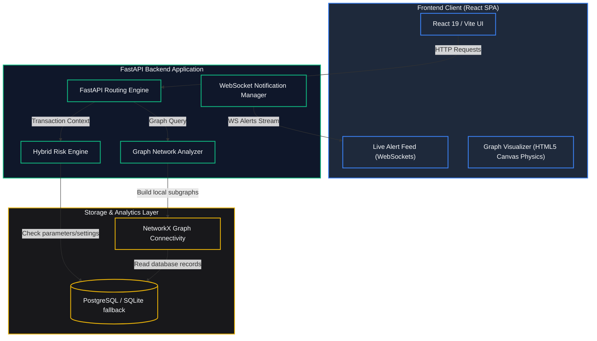
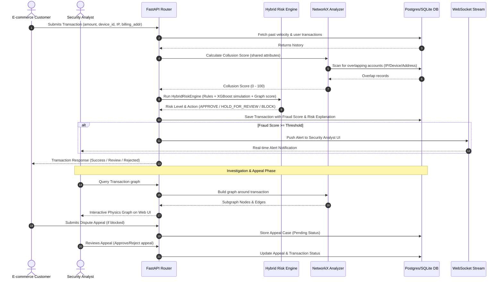

# TrustGraph AI


### Real-Time E-Commerce Fraud Detection & Interactive Graph Collusion Analysis

---

## Why TrustGraph AI?

Traditional fraud detection systems analyze transactions individually, making it difficult to detect organized fraud rings.

TrustGraph AI combines:

- Machine Learning
- Graph Analytics
- Explainable AI (XAI)
- Real-time Alerts

to identify suspicious relationships between users, devices, IP addresses, payment methods, and shipping locations.

## 1. Problem Statement & Objective

### The Problem
Modern e-commerce platforms lose billions to organized transaction fraud. Sophisticated fraudsters rarely operate in isolation; they utilize **collusion rings**—orchestrations where multiple accounts share physical devices, coordinate from identical IP subnets, or exploit mismatched billing and shipping locations to bypass traditional payment gateway triggers. Standard point-in-time fraud rules fail to recognize these interconnected relational graphs, leaving merchants exposed.

### The Objective
TrustGraph AI solves this by analyzing transactions not just as single events, but as connected nodes in a global network. 
Our objective is to provide a multi-layered risk evaluation pipeline that:
1. **Identifies** high-velocity and mismatched transaction patterns (Heuristics).
2. **Predicts** anomalous behavior signatures using machine learning (Inference Modeling).
3. **Exposes** collusion clusters (Device/IP sharing) utilizing NetworkX topology.
4. **Visualizes** these relational fraud rings interactively so risk analysts can instantly inspect nodes, analyze Explainable AI (XAI) factors, and resolve appeal disputes.

---

## 2. System Architecture

TrustGraph AI is split into a React client application and a FastAPI backend service, designed to scale with a PostgreSQL datastore and real-time event streaming over WebSockets.



---

## 3. Project Workflow

The lifespan of a transaction from submission to review and potential appeal resolution follows this pipeline:



---

## 4. Key Features

1. **Analytical Dashboard**: Summarizes total transaction counts, active alert metrics, pending dispute counts, and revenue at risk. Includes live WebSocket alerts stream.
2. **Fraud Investigation Panel**: Lists transaction logs with adjustable query parameters. Click any entry to inspect its metadata details, gauge risk metrics, read Explainable AI (XAI) factors, and visualize node connections.
3. **Graph Visualizer**: A custom canvas force-directed graph modeling user relations, devices, cards, and transactions to uncover complex fraud rings.
4. **Appeals Management**: Merchants can appeal blocked transactions; Analysts view files, leave review annotations, and Approve/Reject disputes.

---

## 5. Technology Stack

| Layer | Technology | Details |
| :--- | :--- | :--- |
| **Backend** | Python 3.10+, FastAPI | High performance asynchronous API engine |
| **Database** | PostgreSQL / SQLAlchemy | Relational persistence with SQLite local fallback support |
| **Analysis** | NetworkX, NumPy, Scikit-Learn | Network topology graph construction, heuristic checks, ML logic |
| **Frontend** | React 19, TypeScript, Vite | Scalable, typed component structure |
| **Styling** | Tailwind CSS v4, Lucide Icons | Responsive, custom dark-mode aesthetics |
| **Visuals** | Recharts, HTML5 Canvas | Real-time trend visualizers, force-directed physics engine graph |
| **Containerization** | Docker & Docker Compose | Multi-container isolation for deployment portability |

---

## 6. Project Folder Structure

```
trustgraph-ai/
├── backend/                  # FastAPI Application
│   ├── app/
│   │   ├── api/              # Route controllers (auth, admin, transactions, appeals, graph)
│   │   ├── core/             # Settings, JWT security, WebSocket notifications
│   │   ├── db/               # SQLAlchemy engine & session lifecycle
│   │   ├── models/           # DB tables schema definition (SQLAlchemy)
│   │   ├── schemas/          # API Request/Response validations (Pydantic)
│   │   └── services/         # Core logic (DB seeder, HybridRiskEngine, GraphAnalyzer)
│   ├── main.py               # Application entrypoint & initialization
│   ├── requirements.txt      # Python package requirements
│   └── Dockerfile            # Container definition for Python backend
├── frontend/                 # React SPA Application
│   ├── public/               # Static assets
│   ├── src/
│   │   ├── assets/           # UI media & resources
│   │   ├── components/       # Reusable components (Sidebar, StatCard, Canvas Graph Visualizer)
│   │   ├── context/          # Context providers (Authentication, WebSocket Alerts)
│   │   ├── pages/            # Page components (Dashboard, Transactions, Appeals, Admin, Login)
│   │   ├── services/         # Axios API connection handlers
│   │   ├── types/            # TypeScript interfaces
│   │   ├── App.css           # Custom styles
│   │   ├── App.tsx           # Route layout container
│   │   ├── index.css         # Styling global rules
│   │   └── main.tsx          # Application render engine
│   ├── package.json          # Dependency scripts & configs
│   ├── package-lock.json     # Lockfile
│   ├── tsconfig.json         # TS configuration
│   ├── vite.config.ts        # Vite packager setup
│   ├── nginx.conf            # Nginx server setup for SPA router
│   └── Dockerfile            # Container build for React SPA
├── docker-compose.yml        # Docker composition map
└── README.md                 # Main Project Documentation
```

---

## 7. Installation & Setup Instructions

### Pre-requisites
- [Docker & Docker Compose](https://www.docker.com/) installed.
- (For local dev) Python 3.10+ and Node.js 18+.

### Method 1: Running via Docker Compose (Recommended)
This method spins up PostgreSQL, the FastAPI backend, and the React frontend served by Nginx in unified containers.

1. **Clone the repository**:
   ```bash
   git clone https://github.com/raghavendra3107/TrustGraph-AI.git
   cd trustgraph-ai
   ```
2. **Build and start the services**:
   ```bash
   docker-compose up --build
   ```
3. **Access the application**:
   - **Frontend App**: [http://localhost:3000](http://localhost:3000)
   - **Backend API**: [http://localhost:8000](http://localhost:8000)
   - **OpenAPI Swagger UI**: [http://localhost:8000/docs](http://localhost:8000/docs)

### Method 2: Running Locally (Development Mode)

#### 1. Setup Backend
Navigate to `backend/`, install requirements, and run via Uvicorn.
```bash
cd backend
python -m venv venv
# Windows:
.\venv\Scripts\activate
# Unix/macOS:
source venv/bin/activate

pip install -r requirements.txt
uvicorn main:app --reload
```
*Note: If no database URL environment variable is supplied, the backend defaults to a local SQLite database (`trustgraph.db`) for zero-configuration development.*

#### 2. Setup Frontend
Navigate to `frontend/`, install dependencies, and run Vite.
```bash
cd ../frontend
npm install
npm run dev
```
- **Local Dev Site**: [http://localhost:5173](http://localhost:5173)

---

## 8. Demo Credentials & Profiles

On initial database creation, seed values are injected. You can log in using these roles:

| Account Type | Email | Password | Role Description |
| :--- | :--- | :--- | :--- |
| **System Admin** | `admin@trustgraph.ai` | `admin123` | Adjust thresholds, configure engine weights |
| **Security Analyst** | `analyst@trustgraph.ai` | `analyst123` | Inspect transactions, view collusion graph, decide disputes |
| **Partner Merchant** | `merchant@trustgraph.ai` | `merchant123` | Create transaction logs, inspect dispute outcomes |

---

## 9. Current Progress

## Current Progress

### Completed

- Project Planning
- System Architecture
- Backend Structure
- Frontend Structure
- README
- GitHub Repository

### In Progress

- Fraud Detection API
- Graph Analysis
- Dashboard
- Appeals Module

### Upcoming

- Model Training
- Deployment
- Performance Optimization
---

## 10. Future Enhancements

---

# Team

**Project Name**

TrustGraph AI

**Hackathon**

AI Build Hackathon 2026

**Team Members**

- Nandipati Raghavendra
- Palle Prabhas
- Sowmya Sri
---

## Development Roadmap

### Phase 1 (Checkpoint 1)

- Project Architecture
- Backend Structure
- Frontend Structure
- README
- GitHub Repository

### Phase 2

- Fraud Detection API
- Graph Analysis
- Authentication
- Dashboard

### Phase 3

- AI Risk Engine
- Appeals Module
- Deployment
- Demo Video