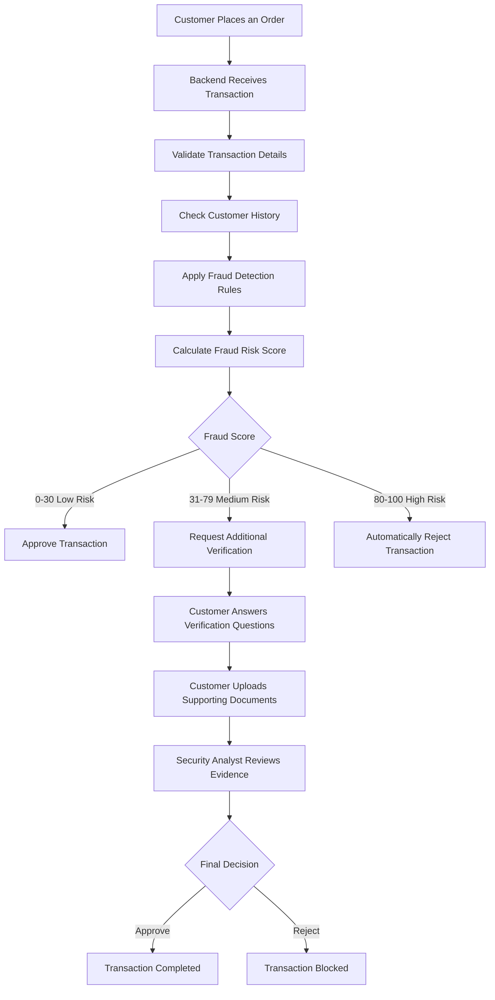
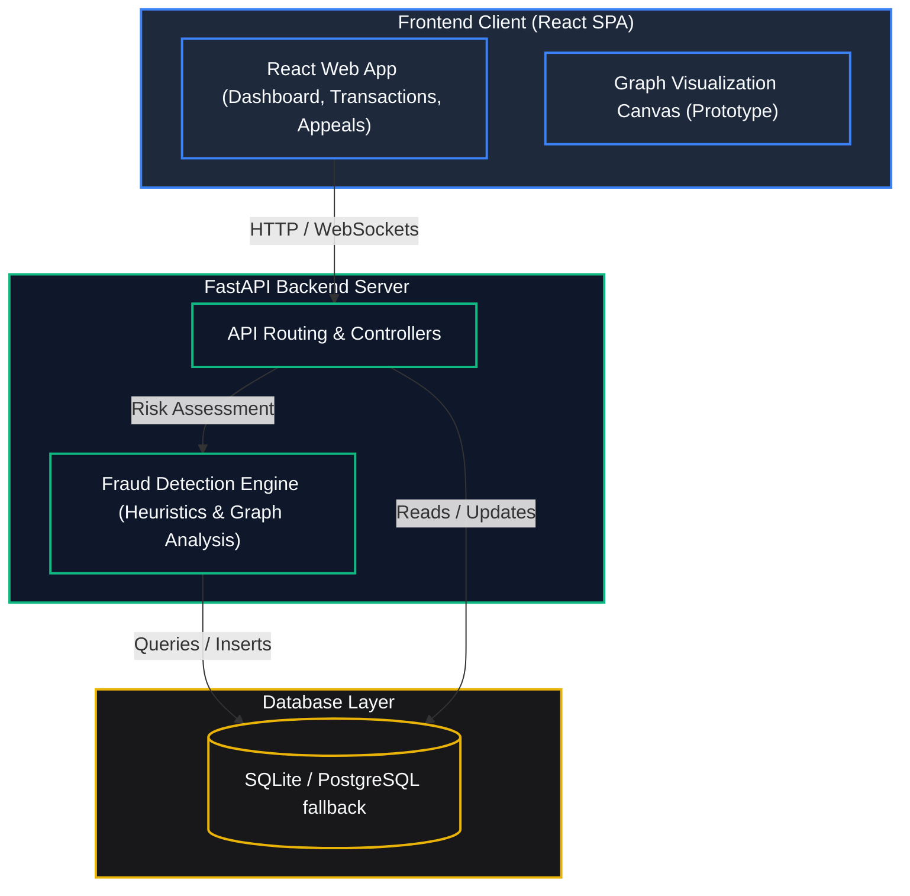
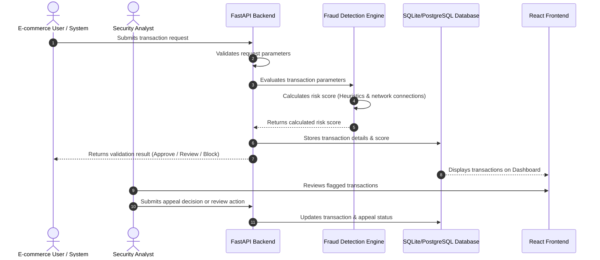

# TrustGraph AI


### E-Commerce Fraud Detection & Graph Collusion Analysis

TrustGraph AI is a full-stack web application that helps e-commerce companies detect fraudulent transactions before financial losses occur. It analyzes customer transactions, identifies suspicious relationships between users, devices, IP addresses, and shipping addresses, calculates a fraud risk score, and helps security analysts review high-risk transactions through an interactive dashboard.

---


## Why TrustGraph AI?

Traditional fraud detection systems analyze transactions individually, making it difficult to identify organized fraud rings.

TrustGraph AI analyzes relationships between transactions, users, devices, and IP addresses to detect suspicious patterns that may indicate fraudulent activity.

---

## Example Scenario

Suppose two different customer accounts use:

- Same Device ID
- Same IP Address
- Same Shipping Address

Although the account names are different, the system considers this suspicious because one person may have created multiple accounts to misuse offers or commit fraud.

TrustGraph AI detects this relationship and assigns a higher fraud risk score.

The system also checks the customer's past transaction history.

For example:

- Too many product returns
- Frequent refund requests
- Repeated complaints about wrong items received
- Multiple failed payment attempts
- Many accounts using the same device or IP address
- Multiple failed login attempts
- Multiple transactions in a very short time

If these suspicious activities are found, the fraud score increases. When the fraud score crosses a predefined threshold, the transaction is sent to the security analyst for manual review.

The fraud score ranges from 0 to 100.

0–30 → Low Risk

31–70 → Medium Risk

71–100 → High Risk


---


## How TrustGraph AI Works



---

## 1. Problem Statement & Objective

### The Problem
E-commerce platforms lose billions annually to coordinated transaction fraud. Fraudsters often operate in networks, sharing billing addresses, devices, and IP addresses across multiple seemingly unrelated accounts to bypass traditional fraud filters. Standard transactional analysis checks each event individually, failing to flag these hidden connections.

### The Objective
TrustGraph AI is designed to help analysts identify and investigate coordinated fraud patterns. The objective of this project is to:
1. **Analyze** incoming transactions for risk using heuristics (amount, category, mismatch flags, frequency).
2. **Calculate** a collusion score based on shared attributes using NetworkX graph analysis.
3. **Store** and record transaction risk profiles in a database.
4. **Present** an interactive web visualizer to map and review relationship networks of suspicious accounts.

---

## 2. System Architecture

TrustGraph AI is built as a client-server architecture containing a React single-page application and a FastAPI backend server, utilizing a SQLite database for local development and PostgreSQL support.



---

## 3. Project Workflow

The transaction execution lifecycle and analyst review process flow as follows:



---

## 4. Features

1. **User Authentication**: Secure sign-in paths for system roles (System Admin, Security Analyst, and Partner Merchant).
2. **Transaction Management**: Record, query, and list incoming transaction logs with status indicators (Approved, Flagged, Blocked).
3. **Fraud Risk Score**: the score is based on both the current transaction and the customer's past history.
4. **Dashboard**: Central metrics panel showing transaction stats, active alerts, and recent flagged requests.
5. **Graph Visualization (Prototype)**: An interactive force-directed canvas mapping connections between transactions, devices, IP addresses, and billing addresses.
6. **Appeals Management**: Workflow allowing merchants to submit dispute appeals for blocked transactions, and security analysts to approve or reject them.

---

## 5. Technology Stack

| Layer | Technology | Description |
| :--- | :--- | :--- |
| **Backend** | Python 3.10+, FastAPI | Web API routing and asynchronous endpoints |
| **Database** | SQLite (dev) / PostgreSQL (prod) | Relational database mapping using SQLAlchemy ORM |
| **Analysis** | NetworkX, NumPy, Scikit-Learn | Attribute sharing analysis and prototype fraud scoring heuristics |
| **Frontend** | React 19, TypeScript, Vite | User interface development framework |
| **Styling** | Tailwind CSS v4, Lucide Icons | Responsive layout styling and icon set |
| **Visuals** | Recharts, HTML5 Canvas | Analytics graphs and custom physics-based node graph visualizer |
| **Containers** | Docker & Docker Compose | Containerized execution environment |

---

## 6. Project Folder Structure

```
trustgraph-ai/
├── backend/                  # FastAPI Application
│   ├── app/
│   │   ├── api/              # Route controllers (auth, admin, transactions, appeals, graph)
│   │   ├── core/             # Settings, JWT security, WebSocket notifications
│   │   ├── db/               # SQLAlchemy engine & session lifecycle
│   │   ├── models/           # DB tables schema definition (SQLAlchemy)
│   │   ├── schemas/          # API Request/Response validations (Pydantic)
│   │   └── services/         # Core logic (DB seeder, HybridRiskEngine, GraphAnalyzer)
│   ├── main.py               # Application entrypoint & initialization
│   ├── requirements.txt      # Python package requirements
│   └── Dockerfile            # Container definition for Python backend
├── frontend/                 # React SPA Application
│   ├── public/               # Static assets
│   ├── src/
│   │   ├── assets/           # UI media & resources
│   │   ├── components/       # Reusable components (Sidebar, StatCard, Canvas Graph Visualizer)
│   │   ├── context/          # Context providers (Authentication, WebSocket Alerts)
│   │   ├── pages/            # Page components (Dashboard, Transactions, Appeals, Admin, Login)
│   │   ├── services/         # Axios API connection handlers
│   │   ├── types/            # TypeScript interfaces
│   │   ├── App.css           # Custom styles
│   │   ├── App.tsx           # Route layout container
│   │   ├── index.css         # Styling global rules
│   │   └── main.tsx          # Application render engine
│   ├── package.json          # Dependency scripts & configs
│   ├── package-lock.json     # Lockfile
│   ├── tsconfig.json         # TS configuration
│   ├── vite.config.ts        # Vite packager setup
│   ├── nginx.conf            # Nginx server setup for SPA router
│   └── Dockerfile            # Container build for React SPA
├── docker-compose.yml        # Docker composition map
└── README.md                 # Main Project Documentation
```

---

## 7. Installation & Setup Instructions

### Prerequisites
- [Docker & Docker Compose](https://www.docker.com/) installed (for containerized setup).
- Python 3.10+ and Node.js 18+ (for local standalone development).

### Method 1: Running via Docker Compose
This method builds the backend, database, and React frontend into unified containers.

1. **Clone the repository**:
   ```bash
   git clone https://github.com/raghavendra3107/TrustGraph-AI.git
   cd trustgraph-ai
   ```
2. **Build and start the services**:
   ```bash
   docker-compose up --build
   ```
3. **Access the application**:
   - **Frontend App**: [http://localhost:3000](http://localhost:3000)
   - **Backend API**: [http://localhost:8000](http://localhost:8000)
   - **OpenAPI Swagger UI**: [http://localhost:8000/docs](http://localhost:8000/docs)

### Method 2: Running Locally (Development Mode)

#### 1. Setup Backend
Navigate to the `backend/` directory, set up a virtual environment, and launch with Uvicorn.
```bash
cd backend
python -m venv venv
# Windows:
.\venv\Scripts\activate
# Unix/macOS:
source venv/bin/activate

pip install -r requirements.txt
uvicorn main:app --reload
```
*Note: If no database URL environment variable is supplied, the backend defaults to a local SQLite database (`trustgraph.db`) for zero-configuration development.*

#### 2. Setup Frontend
Navigate to the `frontend/` directory, install dependencies, and start the development server.
```bash
cd ../frontend
npm install
npm run dev
```
- **Local Dev Site**: [http://localhost:5173](http://localhost:5173)

---

## 8. Demo Credentials & Profiles

On initial database creation, seed values are injected. You can log in using these roles:

| Account Type | Email | Password | Role Description |
| :--- | :--- | :--- | :--- |
| **System Admin** | `admin@trustgraph.ai` | `admin123` | Adjust thresholds, configure engine weights |
| **Security Analyst** | `analyst@trustgraph.ai` | `analyst123` | Inspect transactions, view collusion graph, decide disputes |
| **Partner Merchant** | `merchant@trustgraph.ai` | `merchant123` | Create transaction logs, inspect dispute outcomes |

---

## 9. Current Progress

### Completed
- [x] Project Planning
- [x] Repository Setup & Git Initialisation
- [x] Backend Structure (Directory layout, initial FastAPI setup)
- [x] Frontend Structure (Vite, React boilerplate setup)
- [x] README Documentation
- [x] Basic UI (Login page, Sidebar templates)

### In Progress
- [/] Fraud Detection Logic (Refining rules engine weights)
- [/] Graph Analysis (Integrating NetworkX attribute overlapping queries)
- [/] Dashboard Integration (Hooking metrics to API endpoints)
- [/] Database Integration (Resolving schema mapping rules)

### Upcoming
- [ ] Machine Learning Model training and integration
- [ ] Authentication Improvements (OAuth/JWT improvements)
- [ ] Deployment and hosting scripts

---

## 10. Team & Hackathon Context

**Project Name**
TrustGraph AI

**Hackathon**
AI Build Hackathon 2026

**Team Members**
- Nandipati Raghavendra
- Palle Prabhas
- Sowmya Sri

---

## 11. Development Roadmap

### Phase 1 (Checkpoint 1)
- [x] Project Architecture
- [x] Backend Structure
- [x] Frontend Structure
- [x] README Documentation
- [x] Standalone GitHub Repository Initialisation

### Phase 2
- [ ] Fraud Detection API implementation
- [ ] Graph connection analysis engine logic
- [ ] User role authentication logic
- [ ] Dashboard analytics panel

### Phase 3
- [ ] AI Risk Engine heuristics training
- [ ] Appeals Module dispute flow execution
- [ ] Production Container deployment setup
- [ ] Final Demo Video demonstration