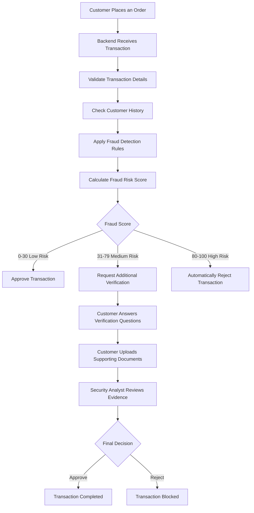

# TrustGraph AI


### E-Commerce Fraud Detection & Graph Collusion Analysis

TrustGraph AI is a full-stack web application that helps e-commerce companies detect fraudulent transactions before financial losses occur. It analyzes customer transactions, identifies suspicious relationships between users, devices, IP addresses, and shipping addresses, calculates a fraud risk score, and helps security analysts review high-risk transactions through an interactive dashboard.

---
## Problem Statement

E-commerce platforms face increasing fraud through fake accounts, shared devices, stolen payment methods, and misuse of return and refund policies. Traditional fraud detection systems analyze transactions individually, making it difficult to identify coordinated fraudulent activities.

## Objective

TrustGraph AI helps detect suspicious transactions by analyzing customer behavior, transaction history, and relationships between users. It calculates a fraud risk score, identifies potential fraud patterns, and helps security analysts review high-risk transactions.


## Why TrustGraph AI?

Traditional fraud detection systems analyze transactions individually, making it difficult to identify organized fraud rings.

TrustGraph AI analyzes relationships between transactions, users, devices, and IP addresses to detect suspicious patterns that may indicate fraudulent activity.

---

## Example Scenario

Suppose two different customer accounts use:

- Same Device ID
- Same IP Address
- Same Shipping Address

Although the account names are different, the system considers this suspicious because one person may have created multiple accounts to misuse offers or commit fraud.

TrustGraph AI detects this relationship and assigns a higher fraud risk score.

The system also checks the customer's past transaction history.

For example:

- Too many product returns
- Frequent refund requests
- Repeated complaints about wrong items received
- Multiple failed payment attempts
- Many accounts using the same device or IP address
- Multiple failed login attempts
- Multiple transactions in a very short time

If these suspicious activities are found, the fraud score increases. When the fraud score crosses a predefined threshold, the transaction is sent to the security analyst for manual review.

The fraud score ranges from 0 to 100.

0–30 → Low Risk

31–79 → Medium Risk

80–100 → High Risk


---


## How TrustGraph AI Works



---


## Features

1. **User Authentication**: Secure sign-in paths for system roles (System Admin, Security Analyst, and Partner Merchant).
2. **Transaction Management**: Record, query, and list incoming transaction logs with status indicators (Approved, Flagged, Blocked).
3. **Fraud Risk Score**: the score is based on both the current transaction and the customer's past history.
4. **Dashboard**: Central metrics panel showing transaction stats, active alerts, and recent flagged requests.
5. **Graph Visualization (Prototype)**: An interactive force-directed canvas mapping connections between transactions, devices, IP addresses, and billing addresses.
6. **Appeals Management**: Workflow allowing merchants to submit dispute appeals for blocked transactions, and security analysts to approve or reject them.

---

## Technology Stack

| Layer | Technology | Description |
| :--- | :--- | :--- |
| **Backend** | Python 3.10+, FastAPI | Web API routing and asynchronous endpoints |
| **Database** | SQLite (dev) / PostgreSQL (prod) | Relational database mapping using SQLAlchemy ORM |
| **Analysis** | NetworkX, NumPy, Scikit-Learn | Attribute sharing analysis and prototype fraud scoring heuristics |
| **Frontend** | React 19, TypeScript, Vite | User interface development framework |
| **Styling** | Tailwind CSS v4, Lucide Icons | Responsive layout styling and icon set |
| **Visuals** | Recharts, HTML5 Canvas | Analytics graphs and custom physics-based node graph visualizer |
| **Containers** | Docker & Docker Compose | Containerized execution environment |

---

## Installation & Setup

### Prerequisites

- Python 3.10+
- Node.js 18+
- Git

### Clone the Repository

```bash
git clone https://github.com/raghavendra3107/TrustGraph-AI.git
cd TrustGraph-AI
```

### Backend

```bash
cd backend
pip install -r requirements.txt
uvicorn main:app --reload
```

### Frontend

```bash
cd frontend
npm install
npm run dev
```

### Access the Application

- Frontend: http://localhost:5173
- Backend API: http://localhost:8000

## Demo Credentials & Profiles

On initial database creation, seed values are injected. You can log in using these roles:

| Account Type | Email | Password | Role Description |
| :--- | :--- | :--- | :--- |
| **System Admin** | `admin@trustgraph.ai` | `admin123` | Adjust thresholds, configure engine weights |
| **Security Analyst** | `analyst@trustgraph.ai` | `analyst123` | Inspect transactions, view collusion graph, decide disputes |
| **Partner Merchant** | `merchant@trustgraph.ai` | `merchant123` | Create transaction logs, inspect dispute outcomes |

---

## Current Progress

### Completed
- [x] Project Planning
- [x] Repository Setup & Git Initialisation
- [x] Backend Structure (Directory layout, initial FastAPI setup)
- [x] Frontend Structure (Vite, React boilerplate setup)
- [x] README Documentation
- [x] Basic UI (Login page, Sidebar templates)

### In Progress
- [/] Fraud Detection Logic (Refining rules engine weights)
- [/] Graph Analysis (Integrating NetworkX attribute overlapping queries)
- [/] Dashboard Integration (Hooking metrics to API endpoints)
- [/] Database Integration (Resolving schema mapping rules)

### Upcoming
- [ ] Machine Learning Model training and integration
- [ ] Authentication Improvements (OAuth/JWT improvements)
- [ ] Deployment and hosting scripts

---

## Team & Hackathon Context

**Project Name**
TrustGraph AI

**Hackathon**
AI Build Hackathon 2026

**Team Members**
- Nandipati Raghavendra
- Palle Prabhas
- Sowmya Sri

---

